# Sync / Async & Blocking / Non-Blocking?

- Synchronous / Asynchronous
  - **결과가 반환될 때 순서와 결과에 관심이 있는지 여부에 초점**
  - Synchronous
    - **작업을 동시에 수행하거나 / 끝나거나 / 끝나는 동시에 시작함**을 의미
    - 호출하는 함수가 해당 작업 결과 값을 받아서 다음 작업을 수행 (Main 스트림에서 처리)
  - Asynchronous
    - **시작과 종료가 일치하지 않고 끝나는 동시에 시작을 하지 않음**을 의미
    - 별도 Thread에서 처리하거나 Event Handler / Callback function 등을 사용하는 경우
    - 호출되는 함수는 콜백 등으로 결과 값을 넘겨주는 방식을 활용해 결과 처리
- Blocking / Non-Blocking
  - 함수를 호출하고 결과를 기다리는 동안 **함수를 호출한 프로그램 (Caller) 의 상태에 초점**
  - **제어권을 넘기거나 혹은 그렇지 않음**
  - Blocking
    - **결과값을 얻기 전까지 현재 Thread를 정지 (다른 작업을 할 수 없다.)**
  - Non-Blocking
    - Thread가 Lock되지 않는다.
    - 즉, **결과를 받을 때까지 다른 작업이 가능하다.**
- Cross Table
  - 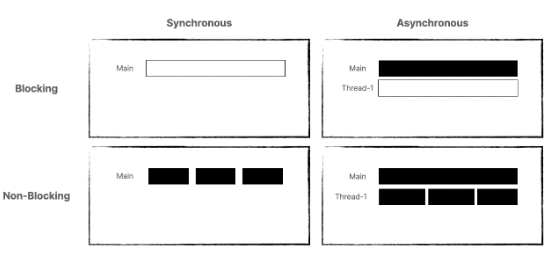
  - 검은색 중간에 끊겨 있는 부분은 완료 여부를 물어보는 부분임. sync이기 때문에.
  - Sync / Blocking
    - **작업을 요청하고, 해당 작업이 완료되어 결과값이 반환되기까지 다른 작업을 할 수 없다.**
  - Sync / Non-Blocking
    - **Caller는 다른 일을 할 수 있지만 틈틈이 요청한 작업 완료 여부를 확인해야 한다.**
  - Async / Blocking
    - **대리인을 시켜 해당 작업을 시키며, 대리인은 해당 작업이 완료될 때까지 기다림**
  - Async / Non-Blocking
    - **대리인을 시켜 해당 작업을 시키며, 대리인이 해당 작업이 완료될 때까지 기다림. Caller가 틈틈이 곁눈질로 작업 완료 여부를 감시함**

- 운영체제의 입장에서
  - Blocking / Non-Blocking
    - CPU를 놓거나 / CPU를 놓지 않음
    - e.g. I/O 요청을 Blocking으로 처리하는 것은 프로세스가 System Call을 한 뒤 Sleep / Wait 상태로 들어간 후 (그동안 CPU를 놓아 아무것도 하지 않은 상태) I/O 처리가 완료되면 Interrupt가 발생하며 프로세스가 재개. 반면 Non-Blocking I/O 요청은 프로세스가 CPU를 놓지 않고 다른 작업을 진행하면서 System Call 호출 결과로써 I/O 요청의 완료 여부를 확인함.
  - Synchronous / Asynchronous
    - 같은 흐름에서 처리하거나 / 다른 흐름에서 처리하거나

### 테코톡 예제 (참고)

- Sync / Blocking
    - 상사는 자기가 서류를 다 읽을 때까지 사원보고 기다리라고 한다. (사원은 Blocking 됐음. 상사가 제어권을 가질 때 사원이 꼼짝 못한다면 그게 블로킹. 아니라면 논블로킹)
    - 상사가 다 읽고 업무를 사원애게 주면 사원 받자마자 그 업무를 진행해야 한다. (사원은 맡겼던 작업이 끝났는지 완료 여부를 계속 확인하고 그게 끝나는 동시에 시작한다.)
    - 사용 예시 ) 자바에서 입력 요청을 할 때 제어권이 넘어왔기 때문에 작업이 blocking된다. 내가 입력을 하자마자 다음 작업이 수행된다.(sync)
    - 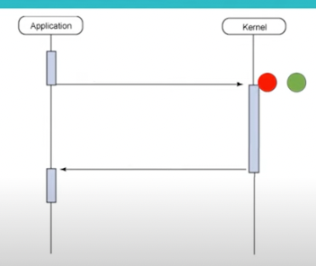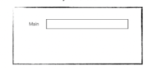
    - 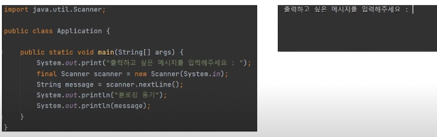

- Sync / Non-Blocking
  - 상사는 자기가 서류를 보는 동안 사원에게 가서 다른 볼 일을 보라고 한다. (사원은 Non-Blocking. 상사가 사원에 대한 제어권을 가지지 않는다.)
  - 하지만 sync 이기 때문에, 사원은 상사가 작업을 완료하셨는지 계속 와서 확인한다. 마치 운영체제의 폴링처럼. 운영체제의 폴링도 충돌회피나 동기화 처리 등을 목적으로 주기적으로 다른 장치의 상태를 검사한다.
  - 암튼 그러다가 상사가 다 보셨다면 끝나자마자 바로 사원은 다음 관련 업무를 시작한다. (sync)
  - 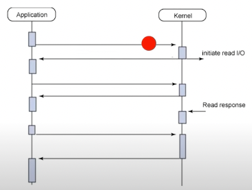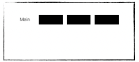
  - 사용 예시 ) 게임에서 맵 넘어가는 부분을 보면 해당 데이터를 가져올 때까지 유저에게 정보의 로드율이 얼마만큼인지를 보여줘야 할 때가 있음. 정보 로드율을 보여주고 있지만 로드가 다 됐는지를 계속 확인하면서 로드가 다 되자마자 화면 전환되는 것...(이거 맞나 ㅠ)

- Async / Blocking
  - 블로킹이니까 제어권을 뺏길 수 있다. 그리고 비동기니까 다른 작업이 끝났을 때 그걸 바로 처리하지 않아도 된다.나중에 처리해도 된다.
  - 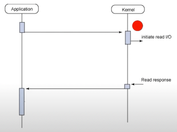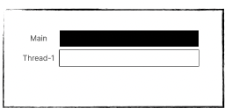
  - 어차피 쟤가 완료했든 말든 신경쓰지 않는 비동기 상태인데 굳이 제어권을 뺏기도록 블로킹이었어야 할까? 쟤가 완료되는지 여부에 대해 관심도 없고, 쟤가 완료가 된다해서 바로 실행할 것도 아닌데 아깝게 쟤가 실행하는 동안 나는 제어권을 뺏겨야 하는 상태임.
  - 이 조합은 논블로킹/어싱크를 쓰려다가 잘못 쓴 경우에 발생할 때가 있다.
  - 상사는 자기가 서류를 보는 동안 사원에게 기다리고 있으라고 한다. 제어권을 뺏기는 블로킹 구조이므로, 상사가 서류 보는 시간 동안 사원은 꼼짝 못함.
  - 그리고 결과를 상사가 넘겨주면 사원은 돌아가서 자기 일을 하다가 아까 받은 일을 처리함.

- Async / Non-Blocking
  - 상사가 사원에 대해 제어권을 움직일 수 없고, 즉 사원의 제어권은 늘 유지되고, 상사가 일을 끝냈든 말든 그 작업을 바로 처리할 필요가 없다.
  - 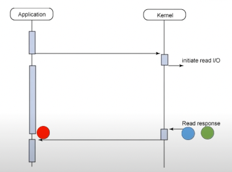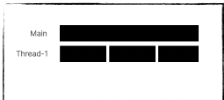
  - 상사는 서류 보는 동안 사원에게 돌아가서 자기 일 하라고 함. 그러고 다 본 뒤 메일을 주면 사원은 암때나 그 작업을 처리함.
  - 사용 예시 ) 자바스크립트에서 API 요청을 해놓고 다른 작업을 하다가 (논블로킹이라서 API 요청으로 인해 제어권을 뺏기지 않음), 콜백으로 추가 작업을 처리할. 콜백으로 완료 여부를 받아 놓고 그 콜백 내용을 바로 쓰지 않고 딴거 좀 하다가 쓸 수 있음. (비동기)
  - 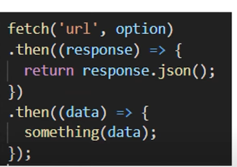