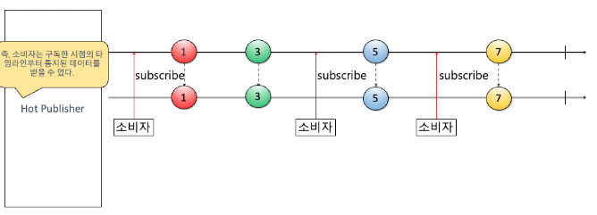
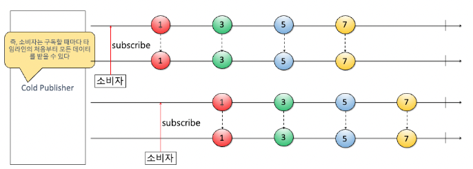

# Mono & Flux

- Project Reactor 에서 `Publisher` 인터페이스를 구현한 추상 클래스이다.

## Flux

- 0 ~ N개의 항목에 대한 비동기 처리 가능한 Sequence를 나타낸다.


## Mono

- 0 ~ 1개의 항목에 대한 비동기 처리 가능한 결과를 나타낸다.


## Laziness

Reactive Stream의 속성이기도 하다. `Flux` / `Mono`에서 `.subscribe()` 메서드로 Consume하기 전까지는 어떠한 동작도 수행하지 않는다.

## 생성하기

Factory method를 사용해 생성한다. `.just()`를 제외하고 각각이 가지는 메서드가 상이하다.

```java
// Flux
Flux<Integer> integerFlux = Flux.just(1, 2, 3);

Flux<String> stringFlux = Flux.just("A", "B", "C");

List<String> stringList = List.of("A", "B", "C");
Flux<String> fluxFromList = Flux.fromIterable(stringList);

Stream<String> stringStream = stringList.stream();
Flux<String> fluxFromStream = Flux.fromStream(stringStream);

Flux<Integer> rangeFlux = Flux.range(1, 5); // Flux(1, 2, 3, 4, 5)
Flux<Integer> intervalFlux = Flux.interval(Duration.ofMillis(100)); // 100ms마다 새로운 값을 만들어 Flux를 생성하며 값은 1부터 시작해 증가

Flux<String> fluxCopy = Flux.from(fluxFromList);

// Mono
Mono<String> helloWorld = Mono.just("Hello World!");

Mono<T> empty = Mono.empty();

Mono<String> helloWorldCallable = Mono.fromCallable(() -> "Hello World!");
Mono<User> user = Mono.fromCallable(UserService::fetchAnyUser);

CompletableFuture<String> helloWorldFuture = MyApi.getHelloWorldAsync();
Mono<String> monoFromFuture = Mono.fromFuture(helloWorldFuture);

Random rand = new Random();
Mono<Double> monoFromSupplier = mono.fromSupplier(rand::nextDouble);

Mono<Double> monoCopy = Mono.from(monoFromSupplier);
Mono<Integer> monoFromFlux = Mono.from(Flux.range(1, 10));
```

### just


- 구독 시 특정 값을 emit한다.

> Create a new Mono that emits the specified item, which is captured at instantiation time.

- Emit되는 값은 인스턴스화가 되는 시점에 캡처되는 값이다.
  - 대표적인 Hot Publisher이다. (Eager)

## (추가 필기) Hot 과 Cold 개념
- hot : 물이 뜨거우면 끓는다. 한번 끓기 시작한 뒤로 계속 동작을 하고 있는다. 딱 한번 시작해주고 멈추지 않는다. 누가 구독을 중간에 하든말든 해오던 마이웨이 그대로 계에에속 끓음. 
  - 이 생산자는 소비자 수랑 상관 없이 데이터를 한 번만 통지한다. 데이터를 통지하는 타임 라인이 하나임. 난 끓고 있음! 멈출 수 없음!
  - 소비자는 발행된 데이터의 처음부터 받는 게 아니라 소비하기 시작한 시점 이후에 데이터를 받는다.
  - 
- cold (가만히 있는 Lazy하기도 한 녀석. 누가 구독하지 않으면 일을 안함.) : 찬 물은 가만히 있다가 구독 시작할 때마다 움직임. 누가 구독 시작해? 다시 데이터 발행함.
  - 소비자가 구독할 때마다 데이터를 처음부터 새로 통지한다.
  - 데이터를 통지하는 새로운 타임이 생성되고, 소비자는 구독 시점과 상관 없이 항상 통지된 데이터를 처음부터 끝까지 받을 수 있다.
  - 

### Error

- 에러를 다루는데 사용하는 메서드
  - `Mono.error(Throwable t)` / `Flux.error(Throwable t)`

### Defer


- Hot Publisher가 Cold Publisher로 전환되도록 돕는다. (Make it Lazy)
  - `.just()`와 다르게 구독을 하지 않으면 인스턴스화가 되지 않아 반환 값을 캡처하지 않는다.
- Supplier를 파라미터로 가지며 구독 시 해당 Supplier의 반환 값을 전달한다.
- (추가) 
- defer은 실제 각 구독이 이뤄질 때까지 인스턴스화가 되지 않게 한다. supplier가 새로운 인스턴스를 만들지 않는다. 그래서 from(Publisher)처럼 효과적으로 쓸 수 있다.
- from()은 

```java
// 1
return someClient.getData()
        .switchIfEmpty(Mono.error(new RuntimeException()));

// 2
return someClient.getData()
        .switchIfEmpty(Mono.defer(() -> Mono.error(new RuntimeException())));

```

- 1번 상황의 경우 해당 코드가 실행될 때마다 Exception이 throw된다.
- 반면 2번 상황의 경우 실제 구독이 있을 때, 즉 받은 데이터가 empty인 경우에만 Exception이 throw된다.

### Mono.fromCallable


```java
public static <T> Mono<T> fromCallable(Callable<? extends T> supplier);
```

- `Callable` supplier를 파라미터로 받아 [`MonoCallable`](https://github.com/reactor/reactor-core/blob/main/reactor-core/src/main/java/reactor/core/publisher/MonoCallable.java) 인스턴스를 생성한다.
  - `MonoCallable` 인스턴스는 값을 생성하는 `Mono`를 생성한다.
    - supplier가 null인 경우 `Mono.empty()`를 생성한다.
- `.defer()`와 마찬가지로 Lazy하게 사용하고자 할 때 활용 가능하다.
  - `Mono.fromCallable()`은 내부 값을 자동으로 Mono로 wrapping한다.

---

## References

- https://velog.io/@zenon8485/Reactor-Java-1.-Mono%EC%99%80-Flux%EB%A5%BC-%EC%83%9D%EC%84%B1%ED%95%98%EB%8A%94-%EB%B0%A9%EB%B2%95
- https://medium.com/@cheron.antoine/reactor-java-1-how-to-create-mono-and-flux-471c505fa158
- https://binux.tistory.com/135